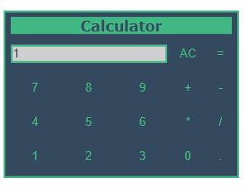

# Calculator

This is a simple project of a basic calculator made on Vue. This is for new Vue developers to see
how things are done on Vue with a simple project. Helping them to understand databindings, components, styling, make the application modular and others aspects.

